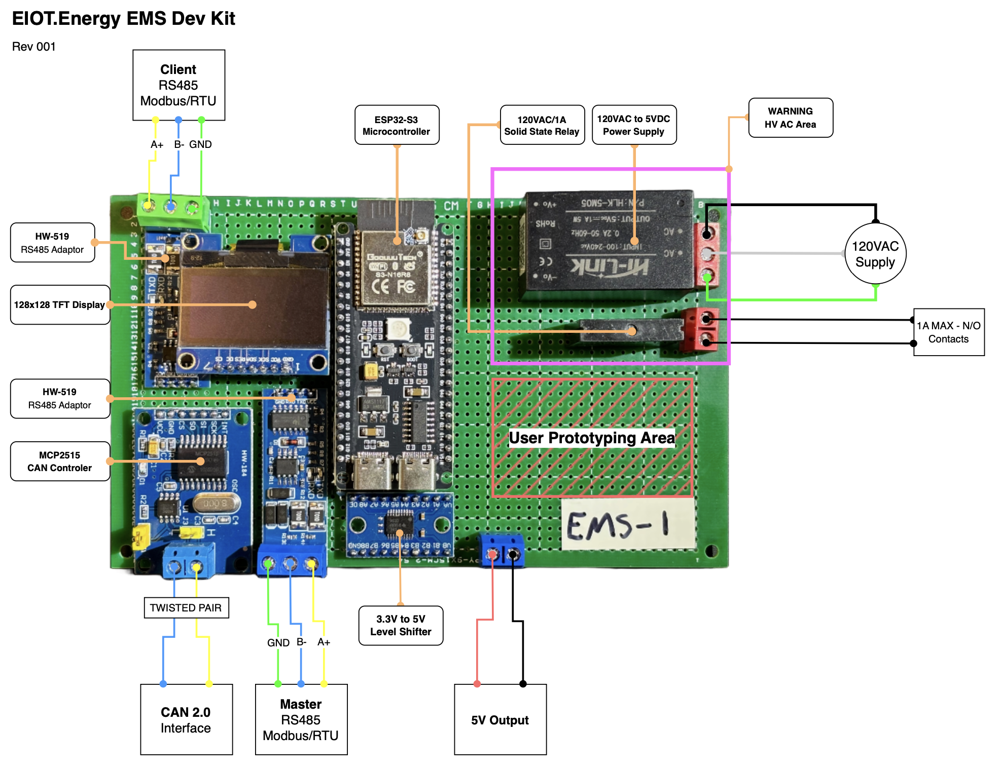

# MeshEMS Hardware

All files and documentation related to the MeshEMS hardware.

## Overview

The **NESL 865B EMS board** pairs an ESP32-S3 N16R8 (dual-core LX7, 16 MB flash, 8 MB PSRAM) with a purpose-built AC metering add-on and peripherals stack (Ethernet, SD Card reader, OLED display). For energy metering applications it supports either Modbus RTU energy meters (DDS238, CHD130, DDSU666 single-phase) or the CircuitSetup ATM90E32 6-channel SPI meter for 3-phase / multi-CT sites, in addition to the SHT20 temp/humidity sensor which communicates via Modbus. An optional external I2C PCF8574 8-channel SSR bank provide load-control outputs.

## Table of Contents

- [Board Diagrams](#board-diagrams)
- [Hardware Overview](#hardware-overview)
  - [Core Specifications](#core-specifications)
  - [RS-485 MODBUS RTU Module](#hw-519-breakout-rs-485-modbus-rtu-module)
  - [CANBUS V2.0 Interface](#mcp2515-breakout---canbus-v20-interface)
  - [Additional Communication Options](#additional-communication-options)
  - [Input/Output Capabilities](#inputoutput-capabilities)
  - [Power Supply Options](#power-supply-options)
  - [Physical Specifications](#physical-specifications)
- [Board Revisions](#board-revisions)
- [Bill of Materials](#bill-of-materials)
- [Related Repositories](#related-repositories)
- [Contributing](#contributing)
- [License](#license)
- [Safety Disclaimer](#safety-disclaimer)
- [Maintainers](#maintainers)

## Board Diagrams

### NESL 865B EMS Board

### NESL 865B EMS Board — with CircuitSetup ATM90E32 6-Channel Meter

### Legacy MeshEMS Board (V001) built in 2025

## Hardware Overview

### Core Specifications
- **Processor:** Xtensa® dual-core 32-bit LX7 microprocessor, up to 240 MHz
- **Memory:** 16MB Flash + 8MB PSRAM (N16R8 variant)
- **Connectivity:** Wi-Fi 802.11 b/g/n and Bluetooth 5 (LE)
- **USB:** USB OTG interface with Type-C connector
- **GPIO:** 45 programmable GPIO pins
- **Dimensions:** 51mm x 25.5mm x 10mm
- **Operating Voltage:** 3.3V
- **Datasheet:** [ESP32S3 Technical Reference Manual](https://www.espressif.com/sites/default/files/documentation/esp32-s3_technical_reference_manual_en.pdf)
- **Development Board Datasheet:** [ESP32S3-DevKitC-1 Datasheet](https://docs.espressif.com/projects/esp-dev-kits/en/latest/esp32s3/esp32-s3-devkitc-1/index.html)

### HW-519 Breakout RS-485 MODBUS RTU Module
- Industry-standard RS-485 interface for MODBUS RTU communication
- Built-in transceiver with automatic direction control
- 3-pin screw terminal for easy connection (A, B, GND)
- Supports baud rates up to 115200 bps
- **Operating voltage:** 5V (level-shifted from ESP32-S3 at 3.3V)
- **Module Datasheet:** [RS-485 Transceiver Datasheet](https://www.analog.com/media/en/technical-documentation/data-sheets/MAX1487-MAX491.pdf)

### MCP2515 Breakout - CANBUS V2.0 Interface
- CAN 2.0B compliant controller and transceiver
- Supports standard (11-bit) and extended (29-bit) identifiers
- Maximum bitrate: 1 Mbit/s
- Screw terminals for CANH and CANL connections
- Integrated termination resistors (jumper selectable)
- **Controller Datasheet:** [MCP2515 CAN Controller](https://ww1.microchip.com/downloads/en/DeviceDoc/MCP2515-Stand-Alone-CAN-Controller-with-SPI-20001801J.pdf)
- **Transceiver Datasheet:** [TJA1051 CAN Transceiver](https://www.nxp.com/docs/en/data-sheet/TJA1051.pdf)

### Additional Communication Options
- **BLE/BLE Mesh:** Utilizing ESP32S3's built-in Bluetooth capabilities

### Input/Output Capabilities
- **Button Array Interface:** Analog input with voltage divider network
- **Display:** Optional 1.3" OLED display (SPI interface)

### Power Supply Options
- **USB Power:** 5V via USB Type-C connector
- **DC Power:** 5VDC via screw terminals to on board, connects directly to 5VIN of ESP32 (5V input MAX).

**Not UL/CE Certified for AC Applications:** This development kit by itself is NOT certified for direct connection to AC mains.

### Physical Specifications
- PCB Dimensions: 150mm x 90mm (main board)
- Mounting: 4x M3 mounting holes (3.2mm diameter)

---
## Board Revisions

| Revision | Year | Status | Diagram |
| --- | --- | --- | --- |
| NESL 865B | 2026 | Current | [Board diagram](docs/images/NESL%20865B_EMS_Board_Diagram.jpg) |
| MeshEMS V001 | 2025 | Legacy | [Board diagram](docs/images/ems_board_pinout_V001.png) |

## Bill of Materials

Bill of Materials files live in [`bom/`](bom/):

| File | Format | Notes |
| --- | --- | --- |
| [MeshEMS V3 BOM (w/o CS Energy Meter)](bom/20260716_MeshEMS_V3_BOM_woCSEnergyMeter%20-%20BOM.csv) | CSV | Compatible with NESL EMS Controller PCB 865B |
| [MeshEMS V3 BOM (w/o CS Energy Meter)](bom/20260716_MeshEMS_V3_BOM_woCSEnergyMeter.xlsx) | XLSX | Source spreadsheet; `Boards to build` drives extended quantities |

## Related Repositories

- [energy-iot/meshems-openami-metering](https://github.com/energy-iot/meshems-openami-metering) — firmware that runs on this hardware (ESP32-S3 / PlatformIO)
- [energy-iot/docs](https://github.com/energy-iot/docs) — platform documentation

## Contributing

Contributions to the hardware design, BOM, and documentation are welcome.

1. Fork the repository and create a feature branch.
2. Make your changes (board files, BOM updates, docs).
3. Sign your commits with `git commit -s`.
4. Open a pull request describing the change and the board revision it targets.

For broader context and integration ideas, see [energy-iot/docs](https://github.com/energy-iot/docs).

## License

This project is licensed under the [CERN Open Hardware Licence Version 2 – Weakly Reciprocal (CERN-OHL-W-2.0)](LICENSE).

> **Note:** CERN-OHL-W is a weakly reciprocal open-hardware licence. Modifications to
> the covered board design files (schematics, PCB layouts, gerbers) must be shared under
> the same licence, while it allows those design files to be combined with separately
> licensed components. See the [CERN-OHL FAQ](https://ohwr.org/project/cernohl/wikis/Documents/CERN-OHL-version-2)
> for details.

## Safety Disclaimer

⚠️ **This hardware connects to AC mains voltage.** It is **NOT UL/CE certified** for direct
connection to AC mains. AC power connections must be installed by a qualified electrician in
accordance with local electrical codes, mounted in an appropriate non-conductive enclosure,
with proper grounding and circuit protection. Always disconnect power before servicing.

**Failure to follow proper electrical safety practices could result in severe electric shock,
fire, serious injury, or death.**

## Maintainers

Maintained by the [energy-iot](https://github.com/energy-iot) organization.
